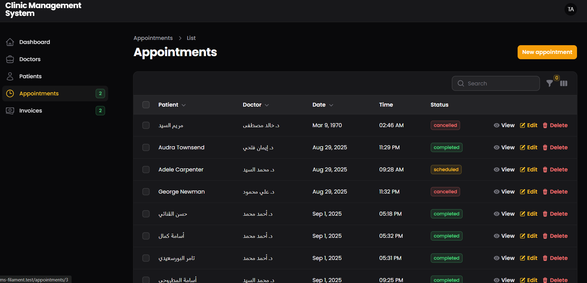

##  🏥 Clincal Management System 

## 📌 Overview  
This project is a **Clincal Management System** built with **Laravel 12** and **FilamentPHP 3**.  
It allows clinics and hospitals to manage doctors, patients, appointments, and invoices efficiently.  
The system also includes **widgets for daily appointments** and **monthly revenue tracking** with interactive charts.  

---

## 🚀 Features  
- 👨‍⚕️ Manage Doctors (add, edit, delete).  
- 🧑‍🤝‍🧑 Manage Patients.  
- 📅 Schedule and track Appointments.  
- 🧾 Generate and manage Invoices with amounts.  
- 📊 Dashboard Widgets:  
  - **Today’s Appointments**.  
  - **Monthly Revenue Chart**.  
- 🔐 Role-based Authorization with Laravel Policies.  
- 📂 Clean architecture with Laravel Resources.  

---

## 🛠️ Tech Stack  
- **Laravel 12** (Backend Framework)  
- **FilamentPHP 3** (Admin Panel & Dashboard)  
- **MySQL** (Database)  
- **TailwindCSS** (Styling via Filament)  

---

## ⚙️ Installation  

1. Clone the repository:  
   ```bash
   git clone https://github.com/Taher-Abdallah/CMS-With-Filament
Next, copy your .env.example file as .env and configure your Database connection.   
   ```bash
   DB_CONNECTION=mysql
   DB_HOST=127.0.0.1
   DB_PORT=3306
   DB_DATABASE=YOUR-DATABASE-NAME
   DB_USERNAME=YOUR-DATABASE-USERNAME
   DB_PASSWORD=YOUR-DATABASE-PASSWROD
  ```   
  ##  Run Packages and helpers

  You have to all used packages and load helpers as below.
   ```bash
composer install
npm install
npm run buil
```
## Generate new application key

You have to generate new application key as below.
   ```bash
php artisan key:generate
```

## Run Migrations and seeders
You have to run all the migration files included with the project and also run seeders as below.
   ```bash
php artisan migrate
php artisan db:seed
```

## 📸 Screenshots
### Dashboard 


### Doctor List 


### Patient List 


### Appointment List 


### Invoices List 


